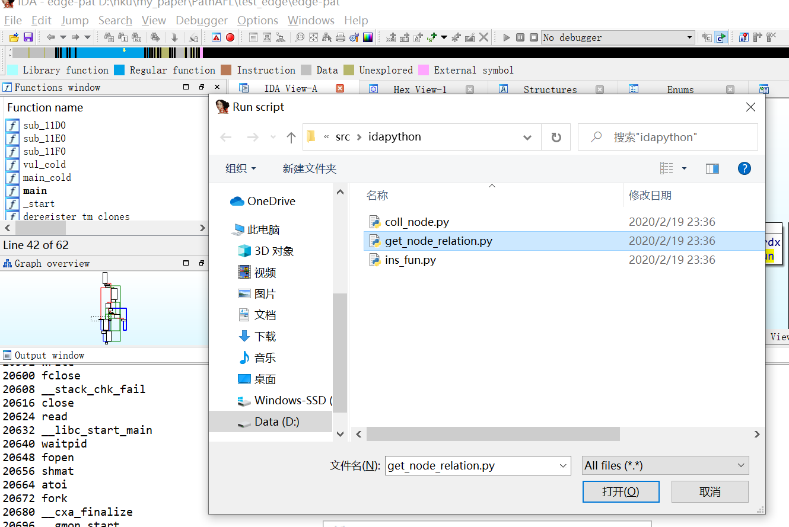
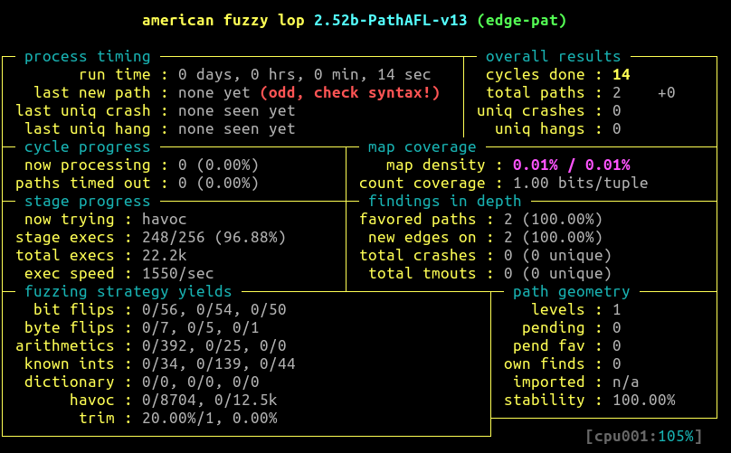

未完待续。。。
```
@inproceedings{DBLP:conf/ccs/YanWLSJ20,
  author    = {Shengbo Yan and
               Chenlu Wu and
               Hang Li and
               Wei Shao and
               Chunfu Jia},
  editor    = {Hung{-}Min Sun and
               Shiuh{-}Pyng Shieh and
               Guofei Gu and
               Giuseppe Ateniese},
  title     = {PathAFL: Path-Coverage Assisted Fuzzing},
  booktitle = {{ASIA} {CCS} '20: The 15th {ACM} Asia Conference on Computer and Communications
               Security, Taipei, Taiwan, October 5-9, 2020},
  pages     = {598--609},
  publisher = {{ACM}},
  year      = {2020},
  url       = {https://doi.org/10.1145/3320269.3384736},
  doi       = {10.1145/3320269.3384736},
  timestamp = {Tue, 13 Oct 2020 16:07:41 +0200},
  biburl    = {https://dblp.org/rec/conf/ccs/YanWLSJ20.bib},```
  bibsource = {dblp computer science bibliography, https://dblp.org}
}


```
# 1. make PathAFL
```
$ make & sudo make install
[*] Checking for the ability to compile x86 code...
[+] Everything seems to be working, ready to compile.
cc -O3 -funroll-loops -Wall -D_FORTIFY_SOURCE=2 -g -Wno-pointer-sign -DAFL_PATH=\"/usr/local/lib/afl\" -DDOC_PATH=\"/usr/local/share/doc/afl\" -DBIN_PATH=\"/usr/local/bin\" afl-gcc.c -o afl-gcc -ldl
set -e; for i in afl-g++ afl-clang afl-clang++; do ln -sf afl-gcc $i; done
cc -O3 -funroll-loops -Wall -D_FORTIFY_SOURCE=2 -g -Wno-pointer-sign -DAFL_PATH=\"/usr/local/lib/afl\" -DDOC_PATH=\"/usr/local/share/doc/afl\" -DBIN_PATH=\"/usr/local/bin\" afl-fuzz.c -o afl-fuzz -ldl
cc -O3 -funroll-loops -Wall -D_FORTIFY_SOURCE=2 -g -Wno-pointer-sign -DAFL_PATH=\"/usr/local/lib/afl\" -DDOC_PATH=\"/usr/local/share/doc/afl\" -DBIN_PATH=\"/usr/local/bin\" afl-showmap.c -o afl-showmap -ldl
cc -O3 -funroll-loops -Wall -D_FORTIFY_SOURCE=2 -g -Wno-pointer-sign -DAFL_PATH=\"/usr/local/lib/afl\" -DDOC_PATH=\"/usr/local/share/doc/afl\" -DBIN_PATH=\"/usr/local/bin\" afl-tmin.c -o afl-tmin -ldl
cc -O3 -funroll-loops -Wall -D_FORTIFY_SOURCE=2 -g -Wno-pointer-sign -DAFL_PATH=\"/usr/local/lib/afl\" -DDOC_PATH=\"/usr/local/share/doc/afl\" -DBIN_PATH=\"/usr/local/bin\" afl-gotcpu.c -o afl-gotcpu -ldl
cc -O3 -funroll-loops -Wall -D_FORTIFY_SOURCE=2 -g -Wno-pointer-sign -DAFL_PATH=\"/usr/local/lib/afl\" -DDOC_PATH=\"/usr/local/share/doc/afl\" -DBIN_PATH=\"/usr/local/bin\" afl-analyze.c -o afl-analyze -ldl
cc -O3 -funroll-loops -Wall -D_FORTIFY_SOURCE=2 -g -Wno-pointer-sign -DAFL_PATH=\"/usr/local/lib/afl\" -DDOC_PATH=\"/usr/local/share/doc/afl\" -DBIN_PATH=\"/usr/local/bin\" afl-as.c -o afl-as -ldl
ln -sf afl-as as
[*] Testing the CC wrapper and instrumentation output...
unset AFL_USE_ASAN AFL_USE_MSAN; AFL_QUIET=1 AFL_INST_RATIO=100 AFL_PATH=. ./afl-gcc -O3 -funroll-loops -Wall -D_FORTIFY_SOURCE=2 -g -Wno-pointer-sign -DAFL_PATH=\"/usr/local/lib/afl\" -DDOC_PATH=\"/usr/local/share/doc/afl\" -DBIN_PATH=\"/usr/local/bin\" test-instr.c -o test-instr -ldl
echo 0 | ./afl-showmap -m none -q -o .test-instr0 ./test-instr
make: *** [Makefile:92: test_build] Error 2
```
因为修改了afl-as，导致编译.test-instr0时会报错，这是正常的，不用管它。

# 2. make binary
以[edge.c](experimental/test1/edge.c)为例
```
# CC=afl-gcc
# afl-gcc edge.c -o edge-pat
```
# 3. Patch binary in IDA

## 3.1 patch x, y, z
使用IDA脚本[coll_node.py](idapython/coll_node.py)对上一步编译生成的二进制文件打补丁，修改其中的参数（主要使用了CollAFL中的方法）,同时生成一个.txt文件，该文件记录了BBL的父子关系等信息

## 3.2 生成文件
从.txt生成一个bin文件，这个bin文件是fuzzing时必须的一个参数。
bin文件就是一个排序后的结构体数组，方便路径评分时直接进行查询，加快计算速度。
```
$ g++ stat_node_child.cpp -std=c++11 -o stat_node_child
$ ./stat_node_child -i edge-pat_node_relation.txt -o edge-pat_node_relation
```

## 3.3 只选择部分函数入口进行插桩，来计算路径hash
当前PathAFL版本编译生成二进制时，默认对所有的插桩点都进行了路径计算，跟踪的路径可能比较多。
这里是论文中实验5.1使用的版本，因为程序很小，需要对所有BBL插桩。
TODO：如果要使用选择部分函数入口计算路径hash的版本，afl-as.c中需要修改一下（待更新）
<!--可以使用IDA脚本[ins_fun.py](idapython/ins_fun.py)再次Patch二进制文件来减少对函数的插桩。 -->

## 3.4 说明
上述都是使用idapython来实现，如果使用LLVM，可以在编译过程中直接完成，下一步计划试试LLVM的实现。

# 4. fuzzing
```
$ pathafl-fuzz -i in/ -o out-pat -h edge-pat_node_relation -- ./edge-pat @@
```
